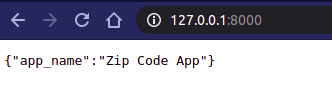
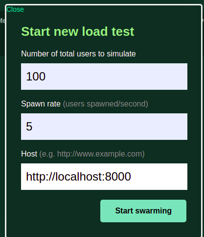

# Criando e publicando microsserviços com FastAPI

[](https://github.com/llrocha/flisol21/blob/main/LICENSE)
[](https://github.com/llrocha/flisol21/actions/workflows/docker-image.yml)
[](https://github.com/llrocha/flisol21/actions/workflows/python-app.yml)

- [Descrição](#description)
- [Instalação do ambiente de desenvolvimento](#envinstall)
- [Base de CEPs](#dbzipcodes)
- [Dando uma olhada no microsserviço](#microservice)
- [Fazendo o build da base e do conteiner Docker](#building)
- [Executando seu conteiner](#running)
- [Testando a aplicação com o LOCUST](#testing)

*Leia este documento em outros idiomas: [English](README.md), [Portuguese](README.pt_BR.md)*

---
## <a name="description"></a>Descrição
Este projeto tem a intenção de demonstrar a construção de um microsserviço utilizando a [FastAPI](https://fastapi.tiangolo.com/). Nesse projeto vamos criar uma base de CEPs usando [SQLite](https://sqlite.org/index.html), demonstraremos o uso do [LOCUST](https://locust.io/) com a nossa API, como ferramenta de análise de performance.
Para criação de nosso ambiente de desenvolvimento, usamos o [pipenv](https://pipenv.pypa.io/en/latest/)

O ambiente de desenvolvimento, está na raíz do projeto, existe um arquivo chamado Pipfile, que contém todas as bibliotecas usadas no projeto, ele é lido pelo pipenv.


---
## <a name="envinstall"></a>Instalação do ambiente de desenvolvimento
Para começar é necessário que você tenha o Python instalado em seu computador, nesse nosso projeto você não precisa instalar o Python com privilégios de administrador. Tutoriais para a instalação do Python estão disponíveis em: https://realpython.com/installing-python/<br>
Aqui vamos usar o Linux, como plataforma de desenvolvimento, caso utilize o Windows, você pode seguir esse [tutorial](https://realpython.com/installing-python/#how-to-install-from-the-full-installer). Caso prefira instalar da Microsoft Store siga esse [tutorial](https://realpython.com/installing-python/#how-to-install-from-the-microsoft-store).<br>
Para fazer download dos instaladores de Python para Windows [clique aqui](https://www.python.org/downloads/windows/)<br>
Em Linux normalmente o Python já vem instalado, mas você precisa verificar a versão do mesmo, precisa ser 3.8+, caso não tenha essa versão, será necessário instalar, siga esse [tutorial](https://realpython.com/installing-python/#how-to-install-python-on-linux), para instalação em Linux.<br>
A seguir como instalar o pipenv:
[](https://asciinema.org/a/EpuDUUwfmis2D2x5SPFD6HrsQ)


---
## <a name="dbzipcodes"></a>Base de CEPs
A base de CEP que foi usada neste projeto, foi encontrada no site [CEPlá](http://cep.la/), você pode baixar a base de: http://cep.la/CEP-dados-2018-UTF8.zip<br>
Existem mais duas bases, eu não sei se elas tem o mesmo formato que essa, portanto pode ser que o [programa](build_database.py) que constrói a base de CEPs, quebre, caso não esteja no layout da base indicada. O arquivo zip contém um arquivo chamado ceps.txt.

Seu ambiente de testes e desenvolvimento já deve estar preparado com o [pipenv](#envinstall)

Para rodar o programa, você vai primeiro precisar da base de CEPs, para isso execute:
```
$ python build_database.py
```

A seguir como construir o banco de dados usado pelo microsserviço:
[](https://asciinema.org/a/x5wIUeHtHpSUBr8jAHDtDTmcS)


---
## <a name="microservice"></a>Dando uma olhada no microsserviço

Agora sim, com a base de CEPs construida, você pode começar a executar o nosso microsserviço:
```
$ uvicorn main:app --reload
```
Onde:<br> main é a referência ao arquivo main.py, e app a referência ao objeto da nossa aplicação. Na linha 7 do arquivo main.py você verá:
```
app = ZipCodeApp()
```

Para poder acessar e testar, abra http://localhost:8000/

Com funciona? O FastAPI usa o uvicorn para executar seu código, assim temos um servidor WEB para receber nossas requisições, todas as alterações feitas no código, quando executamos o uvicorn com a opção --reload, são atualizadas sem a necessidade de parar e subir novamente a aplicação.


---
## <a name="building"></a>Fazendo o build da base e do conteiner Docker
Para fazer a instalação do docker no windows, você precisa baixar o [Docker Desktop](https://docs.docker.com/docker-for-windows/install/), é necessário configurar o windows para poder fazer funcionar o Docker Desktop.<br>
Feito isto, podemos colocar para construir nosso conteiner:
```
$ docker build . --tag zipcodes-app
```
Para verificar se seu conteiner, foi construido execute:
```
$ docker images
REPOSITORY                          TAG                    IMAGE ID       CREATED         SIZE
zipcodes-app                        latest                 9c822e63b8df   5 minutes ago   76.2MB
<none>                              <none>                 7999d1981e82   5 minutes ago   345MB
```


---
## <a name="running"></a>Executando seu conteiner
Agora que temos nosso aplicação dentro de um conteiner, vamos colocar para rodar e verificar se está tudo funcionando.
```
$ docker run -p 8000:8000 zipcodes-app
```
Acesse o browser com o seguinte endereço: http://127.0.0.1:8000/<br>
Se estiver respondendo, você verá algo como:<br>



---
## <a name="testing"></a>Testando a aplicação com o LOCUST
Para colocar o Locust em funcionamento você precisa executar:
```
locust -f locust_zipcode.py
```

Feito isto, você pode abrir http://localhost:8089/, quando você entrar na página a primeira coisa que vai ver é:<br>
